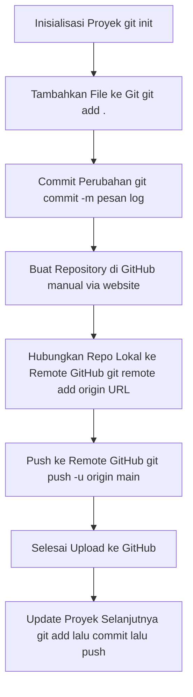

# GITHUB

## Install GIT di Ubuntu
* Open terminal
```bash
sudo su
apt update
apt install git
```
* Cek apakah instalasi sudah berhasil dengan menggunakan `git --version`
* Jalankan perintah berikut di terminal untuk mengkonfigurasikan email Anda dan username yang digunakan dengan akun GIT Anda:
```bash
git config --global user.name "[nama]"
git config --global user.email "[email]"
```
## Daftar Perintah Git

| **Perintah Git**             | **Penjelasan**                                                                 |
|-----------------------------|---------------------------------------------------------------------------------|
| `git init`                  | Membuat repository Git baru di direktori saat ini.                            |
| `git clone <url>`           | Menggandakan repository dari remote (misalnya GitHub) ke lokal.               |
| `git status`                | Menampilkan status perubahan di working directory dan staging area.           |
| `git add <file>`            | Menambahkan file ke staging area untuk disiapkan commit.                      |
| `git add .`                 | Menambahkan semua perubahan (file baru/modifikasi) ke staging area.           |
| `git commit -m "pesan"`     | Menyimpan snapshot perubahan ke repository dengan pesan tertentu.             |
| `git log`                   | Menampilkan riwayat commit di repository.                                     |
| `git diff`                  | Menampilkan perbedaan antar file yang dimodifikasi dan yang di-stage.         |
| `git branch`                | Melihat daftar cabang (branch) di repository.                                 |
| `git branch <nama>`         | Membuat branch baru.                                                           |
| `git checkout <branch>`     | Berpindah ke branch tertentu.                                                  |
| `git merge <branch>`        | Menggabungkan branch tertentu ke branch aktif saat ini.                       |
| `git pull`                  | Mengambil dan menggabungkan perubahan dari remote repository.                 |
| `git push`                  | Mengirim perubahan yang telah di-commit ke remote repository.                 |
| `git remote -v`             | Melihat daftar remote repository yang terhubung.                              |
| `git reset <file>`          | Menghapus file dari staging area (tanpa menghapus perubahan di file).         |
| `git reset --hard`          | Mengembalikan semua perubahan ke commit terakhir (berbahaya, hati-hati!).     |
| `git rm <file>`             | Menghapus file dari repository dan staging area.                              |
| `git stash`                 | Menyimpan sementara perubahan yang belum di-commit.                           |
| `git stash pop`             | Mengambil kembali perubahan dari stash ke working directory.                  |
| `git tag`                   | Menampilkan daftar tag yang dibuat.                                           |
| `git tag <nama_tag>`        | Membuat tag baru pada commit saat ini.                                        |
| `git fetch`                 | Mengambil data dari remote repository tanpa menggabungkannya secara otomatis. |
| `git rebase <branch>`       | Menggabungkan branch seperti merge, tapi lebih bersih dalam riwayat commit.   |
| `git config --global user.name "Nama"` | Mengatur nama pengguna Git secara global.                        |
| `git config --global user.email "email@domain.com"` | Mengatur email pengguna Git.             |


## Remote via SSH

### Generate SSH Key

```bash
ssh-keygen
```

### Tambahkan SSH Key ke GitHub
+ Salin key:

```bash
cat ~/.ssh/id_rsa.pub
```
+ Buka GitHub → Profile → **Settings** → **SSH and GPG keys** → **New SSH Key**

+ Paste dan beri nama sesuai perangkat (misal: Laptop Final)

### Ganti Remote Git dari HTTPS ke SSH (Optional tapi Wajib)
Mengganti URL remote repository GitHub dari protokol HTTPS ke SSH untuk memudahkan proses push/pull tanpa harus memasukkan username atau token setiap kali.

+ **Cek Remote Saat Ini**

```bash
git remote -v
```
Jika hasilnya seperti ini, berarti masih menggunakan HTTPS:

```bash
origin  https://github.com/USERNAME/REPO.git (fetch)
origin  https://github.com/USERNAME/REPO.git (push)
```

+ **Ubah Remote ke SSH**

Gunakan perintah berikut:

```bash
git remote set-url origin git@github.com:USERNAME/REPO.git
```
Contoh:

```bash
git remote set-url origin git@github.com:finalarchive/finalarchive.github.io.git
```

+ **Verifikasi Perubahan**

```bash
git remote -v
```
Hasil yang benar akan tampak seperti ini:

```bash
origin  git@github.com:finalarchive/finalarchive.github.io.git (fetch)
origin  git@github.com:finalarchive/finalarchive.github.io.git (push)
```

+ **Uji Koneksi SSH ke GitHub (Opsional)**

```bash
ssh -T git@github.com
```
Jika berhasil, akan muncul:

```vbnet
Hi USERNAME! You've successfully authenticated, but GitHub does not provide shell access.
```

## Melihat dan Mengambil Perubahan
### Melihat dan Mengambil Perubahan
`git status` Menampilkan file yang dimodifikasi, ditambahkan, atau dihapus.

`git diff` Menampilkan perbedaan isi file yang belum di-stage.

`git diff --cached` Lihat perubahan yang sudah di-stage:

### Mengambil Perubahan dari Remote (GitHub, GitLab, dll)
`git fetch` Ambil update dari remote (tanpa menggabungkan)

`git merge origin/main` Gabungkan perubahan dari remote ke lokal - Ganti main dengan nama branch kamu

`git pull origin main` Ambil dan gabungkan sekaligus

!> Jika  saat `git pull` atau `git merge` muncul konflik, kamu harus menyelesaikannya secara manual

## Workflow Git - GitHub



## 📘 Panduan Git: Branch, Checkout, Merge & Workflow

### 🔧 Perintah Git Dasar untuk Branch

+ **Membuat Branch Baru**

```bash
git branch nama_branch
```

**Contoh:**

```bash
git branch fitur-login
```

+ **Berpindah ke Branch Lain**

```bash
git checkout nama_branch
```

**Contoh:**

```bash
git checkout fitur-login
```

+ **Buat dan Langsung Pindah ke Branch Baru**

```bash
git checkout -b nama_branch
```

**Contoh:**

```bash
git checkout -b fitur-login
```

+ **Melihat Semua Branch**

```bash
git branch
```

+ **Menggabungkan (Merge) Branch ke Branch Aktif**

```bash
git checkout main
git merge nama_branch
```

**Contoh:**

```bash
git checkout main
git merge fitur-login
```

+ **Menghapus Branch (opsional)**

```bash
git branch -d nama_branch
```

**Contoh:**

```bash
git branch -d fitur-login
```

### 🔁 Alur Kerja Git dengan Branch

```text
+-----------------+          +---------------------+           +------------------+
|    Branch Main  |          |   Branch Fitur A    |           |  Branch Fitur B  |
| (kode stabil)   |          | (fitur baru A)      |           | (fitur baru B)   |
+-----------------+          +---------------------+           +------------------+
        |                           |                                      |
        |<--- Buat branch ----------+<---- Buat branch --------------------+
        |                           |                                      |
        |                           |                                      |
        |                       Kembangkan fitur                           |
        |                           |                                      |
        |<-------- Merge ke Main <-+<------------- Merge ke Main <--------+
        |
   Push ke GitHub
```

### 📌 Contoh Praktik Penggunaan Branch

```bash
# 0. cek nama branch
git branch

# 1. Pindah ke branch utama (main/master)
git checkout main

# 2. Buat branch baru dan langsung pindah
git checkout -b fitur-login

# 3. Tambah file/kode, lalu commit
git add .
git commit -m "Tambah fitur login"

# 4. Pindah kembali ke branch utama
git checkout main

# 5. Gabungkan fitur ke branch utama
git merge fitur-login

# 6. Hapus branch fitur (opsional)
git branch -d fitur-login

# 7. Push hasil ke GitHub
git push origin main
```

!> 💡 Tips Branch
* Gunakan nama branch yang jelas dan konsisten: `fitur-login`, `bugfix-auth`, `update-readme`.
* Selalu `git pull` sebelum melakukan `merge`.
* Untuk kolaborasi tim, gunakan **Pull Request (PR)** di GitHub agar perubahan bisa direview dulu.

## Cara Sinkron Git Local Dengan Github
1. Buat folder (atau masuk ke folder project yang sudah ada)
```bash
mkdir Web-Aplication
cd Web-Aplication
```

2. Inisialisasi git
```bash
git init
```

!> Tips
* Buat Scrip Push Otomatis dengan Timestamp (Script Bash)
``` bash
cat << 'EOF' > commit.sh
#!/bin/bash

commit_message=$(date +"%Y%m%d %H:%M")

git add .
git commit -m "$commit_message"
git push origin main
EOF
```
* Cara pakai:
``` bash
chmod +x commit.sh
./commit.sh
```

3. Tambahkan file lokal
```bash
git add .
git commit -m "Initial commit"
```

4. Sambungkan ke repo GitHub dengan SSH
```bash
git remote add origin git@github.com:finalarchive/Web-Aplication.git
```

5. Push pertama kali

Kalau repo GitHub masih kosong, biasanya branch default GitHub adalah main. Maka Kamu rename branch lokal jadi main. Ini langkah wajib supaya sinkron dengan GitHub::
```bash
git branch -M main
git push -u origin main
```

## Pengaturan File/Folder agar Tidak di-Commit Menggunakan `.gitignore`
### 1. Buat atau edit `.gitignore`

Di root project:

`nano .gitignore`


Tambahkan nama file/folder yang ingin kamu exclude.

Contoh umum:
```bash
node_modules/
.env
*.log
Project/dist/
secret.txt
```

Makna:

`node_modules/` → seluruh folder

`.env` → satu file

`*.log` → semua file dengan ekstensi .log

`Project/dist/` → folder build yang ada di dalam file project

`secret.txt` → file tertentu

### 2. Git hanya mengabaikan file yang belum pernah ter-track

Kesalahan yang sering terjadi:
User memasukkan file ke .gitignore setelah file itu sudah pernah di-commit.

Git tidak akan menghapusnya dari histori secara otomatis.

Kalau file sudah ter-track, kamu harus untrack:

`git rm --cached nama-file.txt`


Untuk folder:

`git rm -r --cached nama-folder/`


Setelah itu:
```bash
git add .
git commit -m "Remove tracked files now ignored"
```
### 3. Contoh .gitignore yang sehat untuk web project
```bash
# Node
node_modules/
npm-debug.log
yarn-error.log

# Build
dist/
build/
.cache/

# Environment
.env
.env.local
.env.production
.env.development

# System files
.DS_Store
Thumbs.db

# Editor files
.vscode/
.idea/
```


!> `.gitignore` bekerja sebelum commit, bukan sesudah.

**PERINGATAN (paling sering bikin orang bingung)**

Kalau folder tersebut pernah ter-commit sebelumnya, Git TIDAK AKAN ignore otomatis.

Harus untrack:
```bash
git rm -r --cached website/website_kpu/node_modules
git rm -r --cached website/website_kpu/dist
git rm -r --cached website/website_kpu/.nuxt
```

Lalu:
```bash
git add .
git commit -m "Clean ignored files"
```


## Push Otomatis dengan Timestamp (Script Bash)

```bash
nano commit.sh
```

```bash
#!/bin/bash

commit_message=$(date +"%Y%m%d %H:%M")

git add .
git commit -m "$commit_message"
git push origin main
```

Cara pakai:
``` bash
chmod +x commit.sh
./commit.sh
```